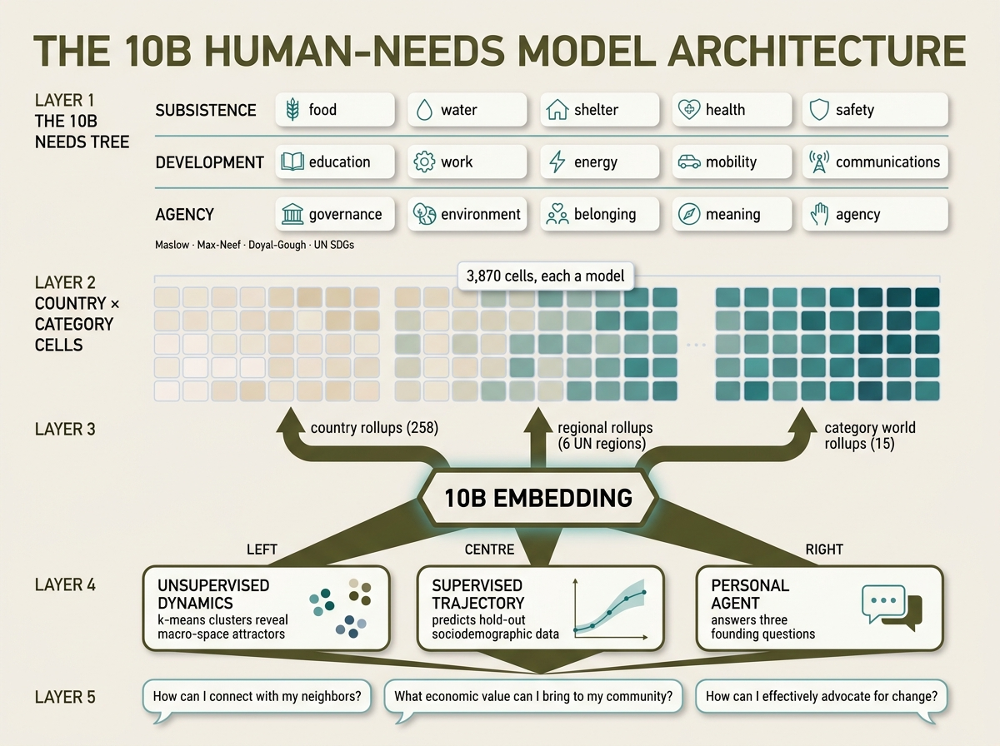

# 10B — the human-needs macro model

`10B` is the registry's top-down model of the human needs of every
population on earth, organised as a 258-country × 15-category satisfaction
matrix that flows into a single embedding. The supervised side predicts
hold-out sociodemographic characteristics; the unsupervised side reveals
hidden dynamics in the macro space; the agent-facing side answers three
founding questions for a user's personal AI agent:

> *How can I connect with my neighbors?*
> *What economic value can I bring to my community?*
> *How can I effectively advocate for change?*



## How the system works

The diagram reads top-to-bottom — the same direction data flows through
the registry.

### 1. The needs tree (`needs-tree.json`)

15 categories of human need, organised into three tiers and anchored in
five frameworks:

| tier         | categories                                                 |
| ------------ | ---------------------------------------------------------- |
| subsistence  | food, water, shelter, health, safety                       |
| development  | education, work, energy, mobility, communications          |
| agency       | governance, environment, belonging, meaning, agency        |

Each category names a slice of CIA World Factbook indicators it consumes
and the engine (closed-form or monte-carlo) that scores them. The
needs tree is itself a model — `global.10B.needs-tree`, materialised at
`schema/` — and every other 10B model carries a schema dependency on it.

### 2. The country × category cells (`countries/<slug>/<category>/`)

For every country and every category, one model directory:

```
countries/india/health/
    indicators.json    # the slice of country data this cell consumes
    model.meta.json    # ModelMeta — name, blurb, mechanism, references
    model.run.json     # engine contract — inputs, spec, output path
    runs/output.json   # composite_score, contributions, embedding
```

The closed-form scorer (`scripts/10b/scorer.py`) maps each indicator to a
[0,1] score via a piecewise-linear ladder — for example, life expectancy
70 years ≈ 0.55, life expectancy 82 years ≈ 0.90 — then takes a coverage-
weighted mean across indicators. Each cell also produces a 16-dim
embedding whose first four dimensions carry actual score signal
(composite, coverage, top-2 indicator scores) and whose remaining
dimensions are seeded by SHA-256 over `country|category` for non-collinear
spread. Total: **3,870 cells**.

### 3. Three converging rollups

The cells flow into three independent aggregations that all feed the
top-level embedding:

| rollup             | path                                  | aggregation                              |
| ------------------ | ------------------------------------- | ---------------------------------------- |
| country (×258)     | `countries/<slug>/`                   | mean across the 15 categories per country|
| region (×6)        | `regions/<region>/[<category>/]`      | UN-geoscheme aggregation by population   |
| category world (×15)| `categories/<category>/`             | population-weighted mean across countries|

Country rollups also expose tier scores (subsistence/development/agency
sub-averages) and a personal-agent text summary. Regional rollups follow
UN's africa / americas / asia / europe / oceania / polar buckets.
Category-world rollups produce the world mean, median, and tail
percentiles for each needs dimension.

### 4. The 10B embedding and its three heads

`global.10B` consumes the three rollup streams and produces the macro
embedding. From the embedding, three downstream models run in parallel:

- **`global.10B.dynamics`** — k-means (k=6, k-means++, deterministic
  seed) on the country × category matrix. Reveals the unsupervised
  structure: six coherent clusters covering wealthy democracies, sub-
  Saharan low-development, microstates, middle-income developing,
  upper-middle, and small-mixed economies. Output:
  `runs/macro-dynamics.json` plus per-country `runs/peers.json` with
  10 nearest neighbours by needs profile.
- **`global.10B.supervised-trajectory`** — supervised hold-out predictor.
  Trains a quintile classifier on 80% of countries using only the
  embedding as features, evaluates AUC on the held-out 20% across
  life-expectancy, fertility-rate, internet-penetration, GDP and Gini
  quintiles. Validates that the embedding meaningfully captures human
  needs beyond the indicators that built it.
- **`global.10B.personal-agent`** — agent-facing query layer that
  answers the three founding questions. For each country it produces
  a `connect / contribute / advocate` triplet rooted in the country's
  category gaps, peer cluster, and distance from world means. Output:
  `personal-agent/runs/<country>.json` and an `index.json`.

### 5. Forecasts

The supervised trajectory is grounded in 466 explicit forecasts:

- 15 cross-country category forecasts ("world-mean food security in
  2030").
- 450 country × category forecasts on the 30 most populous countries —
  the primary supervised hold-out targets.
- 1 macro-trajectory forecast on the embedding's hold-out AUC.

Every forecast carries a `ForecastMeta` schema (prompt, resolution
criteria, expected resolution date, outcome space, schedule) that
round-trips losslessly through the BWM forecast harness.

## File layout

```
global/10B/
├── README.md                          ← you are here
├── needs-tree.json                    ← canonical schema
├── docs/infographic.png               ← architecture diagram (above)
├── model.meta.json + model.run.json   ← global.10B (top-level)
├── runs/                              ← top-level outputs
│   ├── macro-embedding.json
│   ├── macro-dynamics.json
│   └── manifest.json
├── schema/                            ← global.10B.needs-tree
├── dynamics/                          ← global.10B.dynamics
├── supervised-trajectory/             ← global.10B.supervised-trajectory
├── personal-agent/                    ← global.10B.personal-agent
│   └── runs/<country>.json (×258)
├── categories/<category>/             ← cross-country world rollup (×15)
│   └── forecasts/<category>-world-2030.json
├── regions/<region>/                  ← UN-geoscheme rollup (×6)
│   └── <category>/                    ← per-category × per-region (×90)
├── countries/<slug>/                  ← per-country rollup (×258)
│   ├── runs/output.json + peers.json
│   └── <category>/                    ← per-country × per-category (×3870)
│       ├── indicators.json
│       └── runs/output.json
└── forecasts/macro-trajectory-2030.json
```

**Total**: 4,244 schema-validated `ModelMeta` files + 466 `ForecastMeta`
files.

## Regenerating

The full registry is generated end-to-end by the pipeline under
[`../../scripts/10b/`](../../scripts/10b/) in this repo:

```bash
# From this repo's root — writes back into ./global/10B/
bash scripts/10b/pipeline.sh
```

Override the target with `$BWM_10B_ROOT` (a checkout of this repo) or
`$BWM_LOCAL_ROOT` (the writable local registry of a downstream
`bwm-server`) if you want a re-run to land somewhere else. See the
top-level [README](../../README.md) for the full env-var contract.

The pipeline is idempotent (~30s on a recent Mac):

| step | script              | output                                            |
| ---- | ------------------- | ------------------------------------------------- |
| 1    | `generate.py`       | per-cell + rollup `model.meta.json` + `model.run.json` |
| 2    | `scorer.py`         | per-cell `runs/output.json`, country rollups, world means |
| 3    | `extra_models.py`   | `dynamics/`, `supervised-trajectory/`, `personal-agent/` metas |
| 4    | `dynamics.py`       | `runs/macro-dynamics.json` + per-country `peers.json` |
| 5    | `agent_context.py`  | `personal-agent/runs/<country>.json` × 258         |
| 6    | `regions.py`        | UN-geoscheme regional rollups                      |
| —    | `forecasts.py`      | category, country×category, and macro forecasts    |
| —    | `manifest.py`       | `runs/manifest.json` directory artefact            |
| —    | `validate.py`       | schema-validates every `ModelMeta` + `ForecastMeta`|

To regenerate just the architecture infographic above:

```bash
GEMINI_API_KEY=... python3 scripts/10b/generate_infographic.py
```

## Why this shape

The project description calls for a system "where top-down (countries,
cities, datasets) meets bottom-up (human behavior and online activity)"
— and where the meeting point is "an embedding model that captures the
human needs of a population." The 10B registry is the top-down half of
that meeting: the structural schema and supervised anchor against which
the bottom-up simulation will be trained. The three heads keep the
seams clearly named — supervised, unsupervised, and agent — so the
bottom-up trajectory has visible attachment points to grow into.

The needs tree itself is the load-bearing choice: 15 categories is small
enough that every country can be a reasoned point in the same vector
space, and large enough that the dimensions of human flourishing the
project cares about (community, economic contribution, advocacy) all
have a home.
